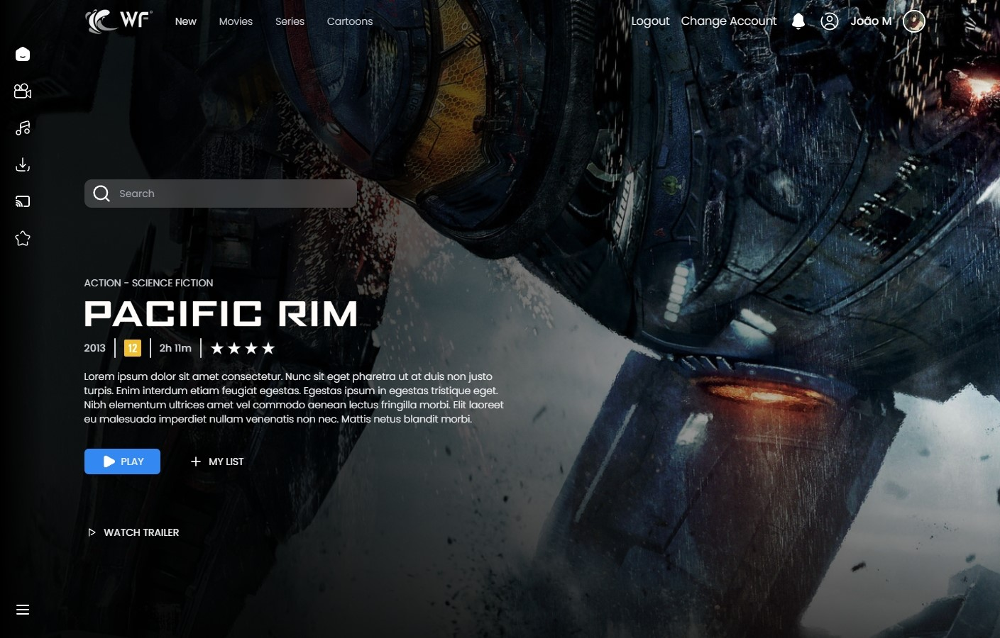
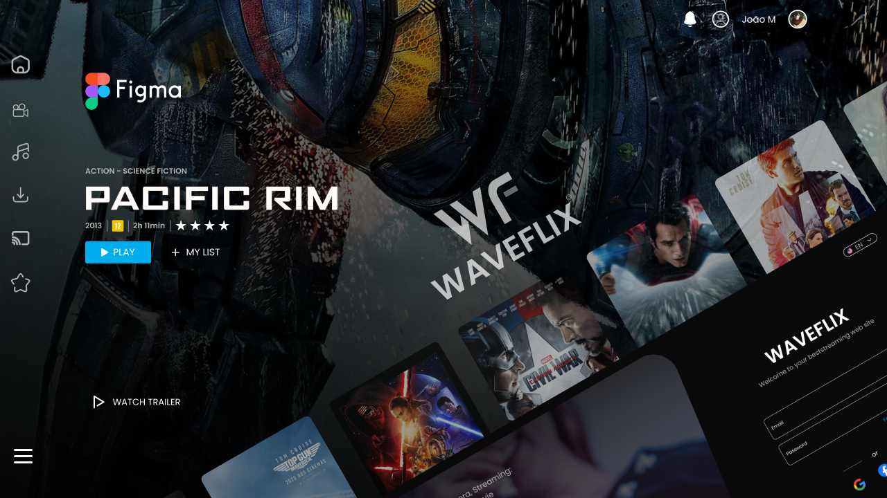
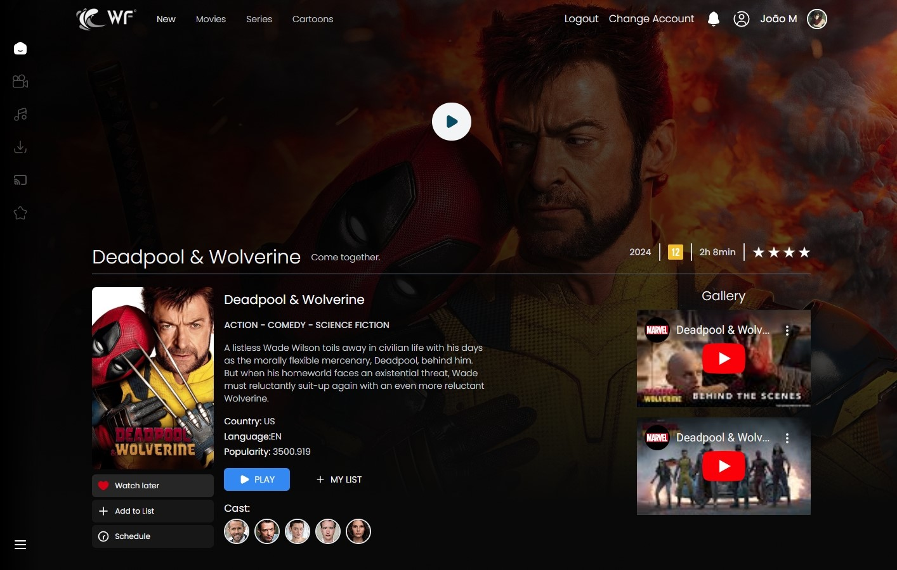
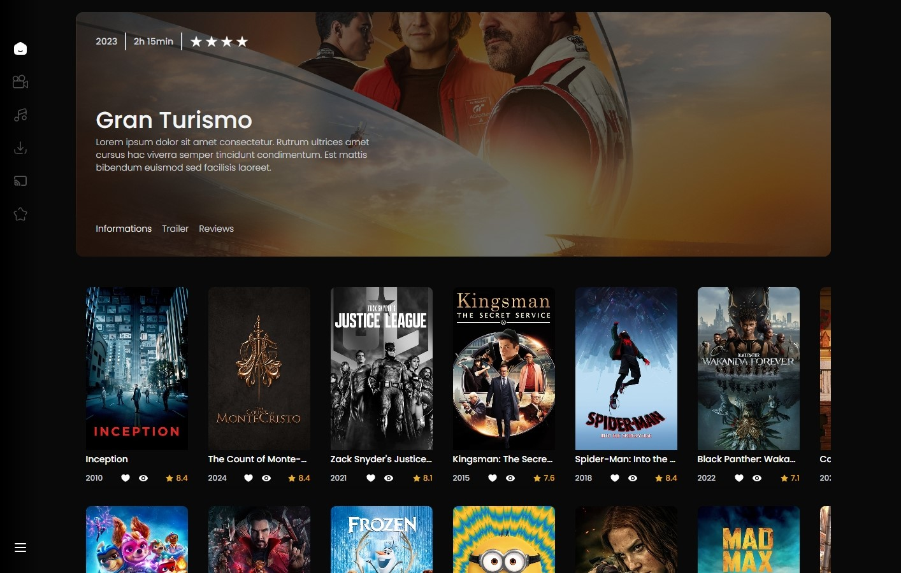
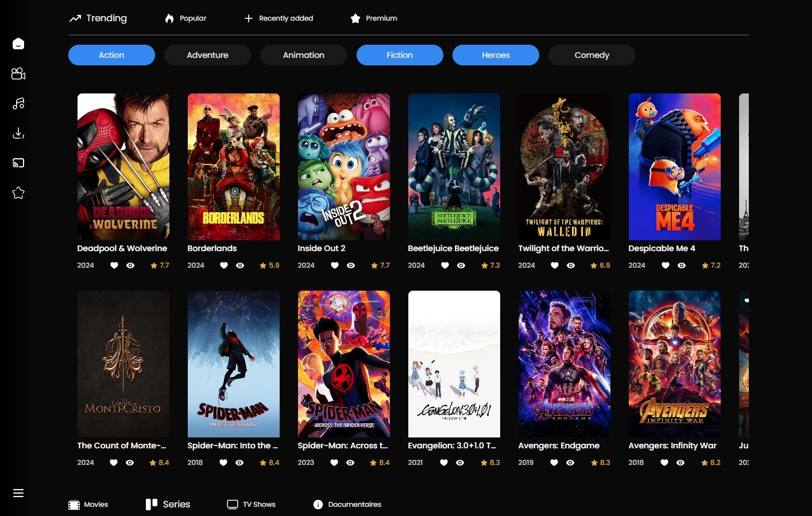
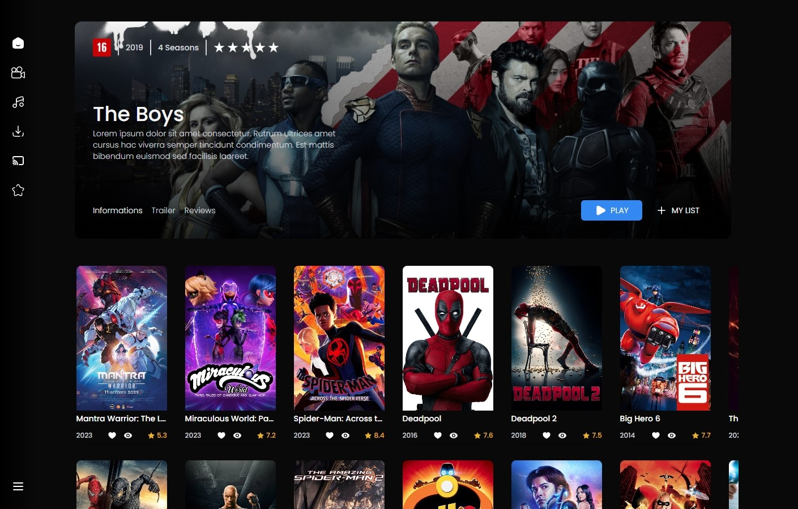
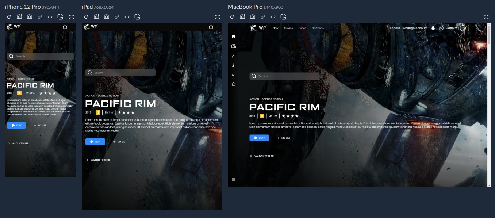
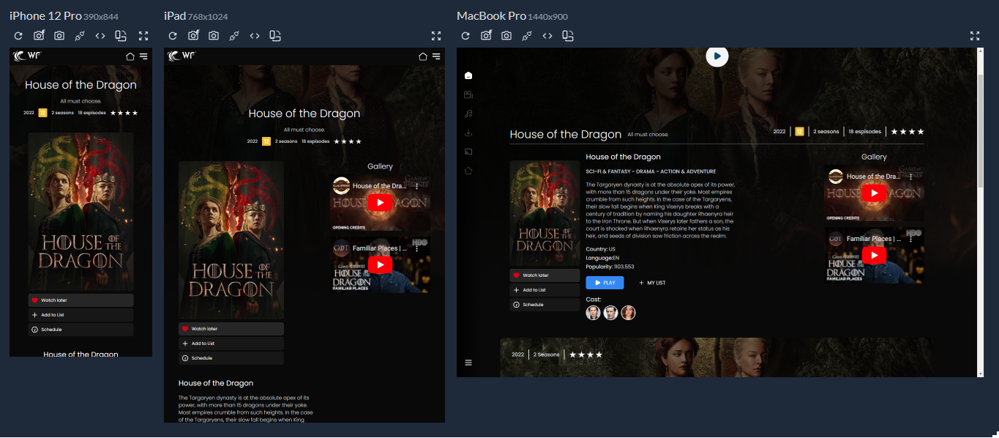
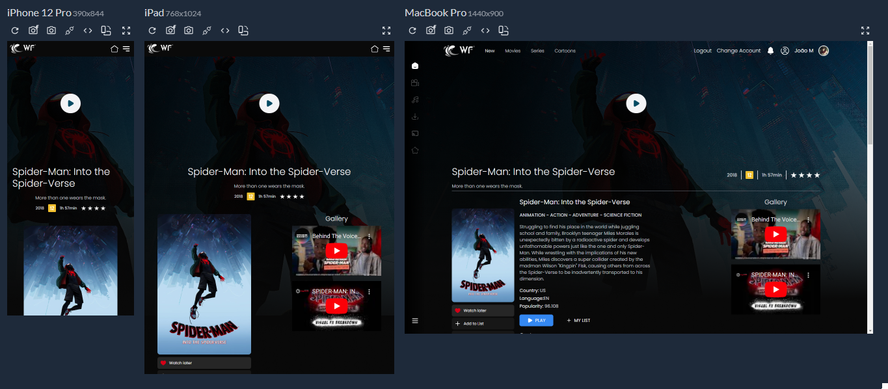
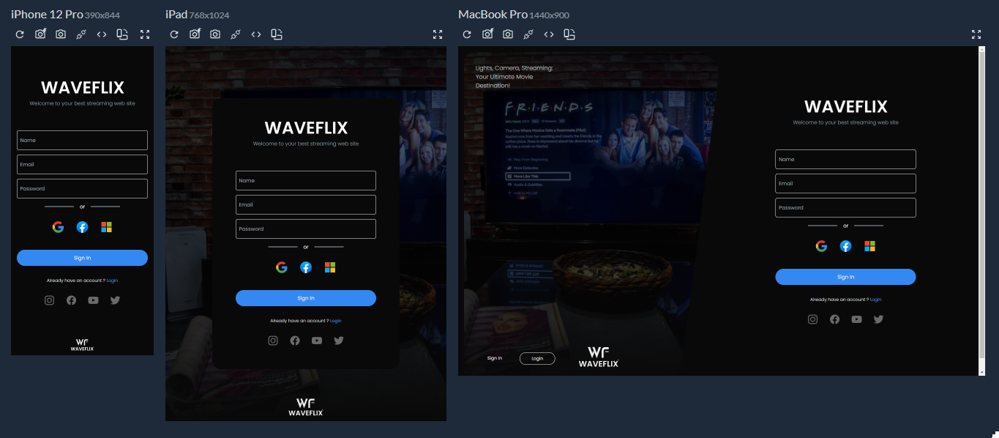

# WaveFlix

<div align="left">
  
  
 
  
   
  
  
    
  
  
  
</div>

###



> Interface de uma aplicação de streaming de filmes e séries usando a API MOVIE DATA BASE.

## 🚀 Instalando

Windows:

```
git clone https://github.com/Joaommsp/waveflix-streaming.git
```

```
cd waveflix-streaming
```

```
npm i
```

```
npm run dev
```

## ✏️ Protótipo e Design

<Mockup>Confira o design do projeto feito no Figma

<a  href="https://www.figma.com/design/jIgZEG3DS6ROXWL4J6fvMX/WaveFlix-Movie-Site-Design-(Community)?node-id=0-1&t=i7oaGciIJ47ctTSm-1" >
  
</a>

> Clique na imagem para ser encaminhado

## 💻 Um pouco do projeto










### 🖱️🅰️ API MOVIE DATA BASE 

<p>
</p>

## 📱 Responsividade

<p>Todo o site é responsivo e se adapta a diferentes tamanhos de tela</p>









## 🔗 Deploy

Clique e acesse o projeto

<div align="left">
 <a href="https://waveflix-streaming.vercel.app/#/"></a>
</div>

## ⭐ Metas

- [x] Uma página viva e elegante
- [x] UX e UI Design
- [x] UX e UI Design
- [x] Utilização da API
- [x] Design Responsivo
- [x] Deploy no Vercel
- [x] Utilização do Tailwind CSS


## 🤓 Me acompanhe para mais projetos

# React + Vite

This template provides a minimal setup to get React working in Vite with HMR and some ESLint rules.

Currently, two official plugins are available:

- [@vitejs/plugin-react](https://github.com/vitejs/vite-plugin-react/blob/main/packages/plugin-react/README.md) uses [Babel](https://babeljs.io/) for Fast Refresh
- [@vitejs/plugin-react-swc](https://github.com/vitejs/vite-plugin-react-swc) uses [SWC](https://swc.rs/) for Fast Refresh
